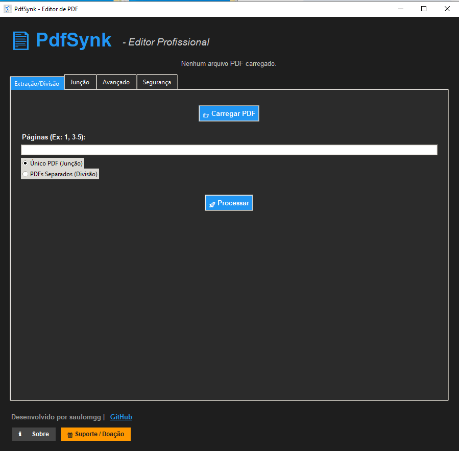

# 📄 PdfSynk - Ferramenta Oficial HubSynk

[](https://github.com/saulomgg/HubSynk)
[](LICENSE)
[](https://github.com/saulomgg/HubSynk)

**PdfSynk** é uma ferramenta profissional de manipulação de PDFs, desenvolvida para ser rápida, modular e segura. Como parte integrante do ecossistema **HubSynk**, ela oferece uma interface moderna para tarefas essenciais do dia a dia.


---

## ✨ Funcionalidades

-   **Extração Inteligente**: Selecione páginas específicas (ex: 1, 3-5) e extraia para um novo arquivo ou divida em múltiplos PDFs.
-   **Junção (Merge)**: Combine múltiplos arquivos PDF em um único documento, organizando a ordem facilmente.
-   **Rotação de Páginas**: Gire páginas selecionadas ou todo o documento em ângulos de 90, 180 ou 270 graus.
-   **Marca D'água**: Aplique marcas d'água personalizadas (baseadas em PDF de uma página) em páginas específicas ou em todo o documento.
-   **Imagem para PDF**: Converta múltiplas imagens (JPG, PNG) em um único arquivo PDF, mantendo a ordem desejada.
-   **Proteção por Senha**: Criptografe seus PDFs com senhas de abertura para garantir a segurança do documento.
-   **Edição de Metadados**: Visualize e edite informações como Título, Autor, Assunto e Palavras-chave do seu PDF.
-   **Interface Moderna**: Tema Dark otimizado para produtividade, sem distrações.
-   **Integração HubSynk**: Totalmente compatível com o hub de ferramentas e verificação criptográfica.

---

## 🚀 Como Usar

1.  **Carregar**: Clique em `📁 Carregar PDF` para abrir seu arquivo base.
2.  **Configurar**: Informe as páginas desejadas, adicione arquivos para junção, configure rotações, marcas d'água, etc.
3.  **Processar**: Clique no botão de ação correspondente (ex: `🚀 Processar`, `🔗 Juntar PDFs`, `🔄 Rotacionar`, `💧 Aplicar Marca`, `🖼️ Converter`, `🔒 Proteger`, `📝 Atualizar`) e escolha onde salvar o resultado.

---

## 🛠️ Estrutura Modular

O projeto foi reestruturado para facilitar a manutenção e escalabilidade:

```text
PdfSynk/
├── main.py              # Ponto de entrada do programa
├── core/                # Lógica de processamento de PDF
├── ui/                  # Interface gráfica (Tkinter/Custom Styles)
├── utils/               # Constantes, cores e helpers
├── assets/              # Ícones, logos e imagens do instalador
└── wiki/                # Documentação detalhada
```

---

## 📦 Compilação e Distribuição

### 1. Gerar Executável (.exe)
Utilize o PyInstaller com o arquivo `.spec` fornecido:
```bash
pyinstaller pdfsynk.spec
```

### 2. Criar Instalador
Abra o arquivo `pdfsynk_installer.iss` no **Inno Setup Compiler** para gerar o instalador profissional com a identidade visual do HubSynk.

---

## 🤝 Suporte e Contribuição

O desenvolvimento do PdfSynk é mantido pela comunidade. Se você gosta do projeto, considere apoiar:

-   ⭐ **GitHub**: [saulomgg/HubSynk](https://github.com/saulomgg/HubSynk)
-   🎁 **Suporte/Doação**: Acesse o botão de suporte dentro do programa.

---
*Desenvolvido com ❤️ por [saulomgg](https://github.com/saulomgg)*
